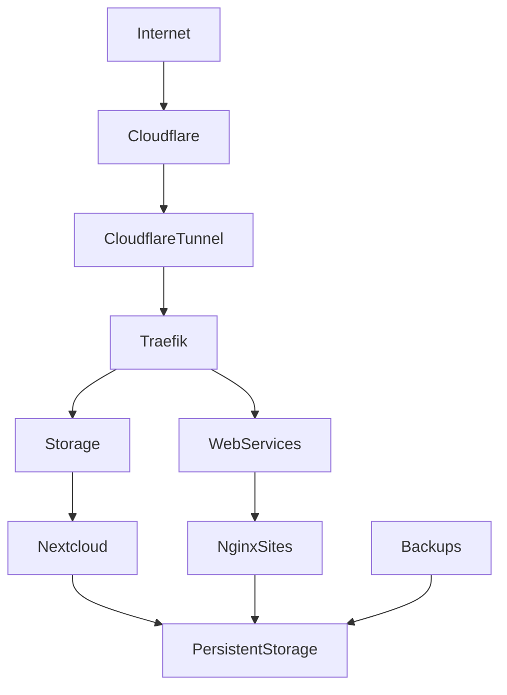

# Homelab Network Design

## Executive Summary

This homelab is a self-hosted infrastructure platform built to develop practical skills in Linux administration, containerisation, networking, reverse proxy technologies, cloud security, and infrastructure operations.

The environment is intentionally designed around a small number of core services that provide a foundation for future expansion while maintaining simplicity and operational reliability.

Current production services include:

* Cloudflare Tunnel
* Traefik Reverse Proxy
* Nginx Web Hosting
* Nextcloud

The infrastructure follows a container-first approach using Docker Compose and separates application deployment, persistent data, logging, documentation, backups, and configuration into dedicated areas.

The homelab serves as both a learning environment and a portfolio project demonstrating infrastructure design, documentation standards, operational processes, and troubleshooting capability.

### Current Objectives

* Securely publish self-hosted services
* Centralise ingress through a reverse proxy
* Host multiple websites behind a single entry point
* Provide self-hosted file storage and collaboration
* Develop repeatable deployment workflows
* Maintain comprehensive documentation

---

## Design Principles

### Infrastructure as Code

All services are deployed using version-controlled Docker Compose configurations and supporting configuration files.

### Least Privilege

Containers are granted only the permissions required for operation wherever practical.

### Segmentation

Services are logically grouped into dedicated stacks and isolated networks.

### Backup and Recovery

Persistent data, configuration files, and critical secrets are backed up independently from container instances.

### Documentation First

Operational procedures, architecture decisions, and deployment instructions are documented as part of the implementation process.

### Security by Default

Services are assumed hostile until explicitly trusted. Administrative interfaces receive additional protection controls.

### Automation

Routine deployment, updates, monitoring, and backup activities are designed for automation.

---

## High-Level Architecture

External traffic enters through Cloudflare and is securely transported into the environment through a Cloudflare Tunnel.

Traefik acts as the central reverse proxy and routing layer. All published services are routed through Traefik rather than exposing individual applications directly.

Current application services consist of:

* Static web hosting using Nginx
* Self-hosted cloud storage using Nextcloud

Persistent data is stored separately from container lifecycles to simplify maintenance, upgrades, and recovery.

### Architecture Flow

```text
Internet
    │
    ▼
Cloudflare
    │
    ▼
Cloudflare Tunnel
    │
    ▼
Traefik Reverse Proxy
    │
    ├── Nginx Websites
    │
    └── Nextcloud
            │
            ▼
     Persistent Storage
            │
            ▼
         Backups
```

---

## Architecture Diagram



---

## Physical Network Design

### ISP Connection

A residential internet connection provides external connectivity to the environment.

### Router / Firewall

A dedicated router/firewall platform provides:

* Network boundary protection
* Traffic control
* Future VLAN implementation
* Policy enforcement

### Core Switching

Managed switching infrastructure provides:

* Layer 2 connectivity
* Future VLAN segmentation
* Port management
* Network expansion capability

### Wireless Infrastructure

Wireless access points support:

* User devices
* Guest devices
* Future IoT segmentation

### Server Infrastructure

A dedicated Linux server hosts:

* Docker Engine
* Docker Compose stacks
* Application services
* Storage services

### Management Devices

Administrative workstations access infrastructure through approved management channels.

---

## Logical Network Design

### Management Network

**Purpose**

Administrative access to infrastructure devices and management interfaces.

---

### Server Network

**Purpose**

Hosts container workloads and backend services.

---

### User Network

**Purpose**

Provides access to approved services and applications.

---

### Guest Network

**Purpose**

Provides internet access for visitors while remaining isolated from infrastructure resources.

---

### Recommended Segmentation Strategy

Future network segmentation should include:

* Management VLAN
* Server VLAN
* User VLAN
* Guest VLAN

Inter-VLAN communication should be explicitly controlled through firewall policies.

---

## Security Architecture

### Identity and Access Management

* Unique administrative accounts
* Strong authentication practices
* Protected administrative interfaces
* Cloudflare Access planned for sensitive services

### Remote Access

Remote administration is performed through secure access methods rather than direct public exposure.

### Secrets Management

Sensitive values are stored separately from application configuration and source control repositories.

### Reverse Proxy Security

Traefik provides:

* Centralised ingress
* Request routing
* Middleware enforcement
* Security header support

### Container Security

* Service isolation
* Dedicated networks
* Minimal exposed ports
* Persistent data separation

### Logging

Service logs are retained for operational troubleshooting and future centralisation.

### Backups

Critical data receives routine backups.

### Disaster Recovery

Recovery procedures focus on:

1. Rebuild infrastructure
2. Restore configuration
3. Restore persistent data
4. Validate service operation

### Patch Management

Regular updates are applied to:

* Host operating system
* Docker Engine
* Container images
* Infrastructure tooling

---

## Core Services

### Traefik

#### Purpose

Central ingress controller and reverse proxy for all published services.

#### Dependencies

* Docker
* Cloudflare Tunnel

#### Traffic Flow

```text
Internet
    ▼
Cloudflare
    ▼
Cloudflare Tunnel
    ▼
Traefik
    ▼
Backend Service
```

#### Typical Use Cases

* HTTP request routing
* Reverse proxying
* Service publication
* Middleware enforcement

---

### Cloudflare Tunnel

#### Purpose

Provides secure inbound connectivity without exposing the homelab directly to the internet.

#### Dependencies

* Cloudflare Platform
* Traefik

#### Typical Use Cases

* Secure service publishing
* Remote access
* Reduced attack surface

---

### Nginx Web Services

#### Purpose

Hosts static websites and web content.

#### Dependencies

* Traefik
* Persistent storage

#### Typical Use Cases

* Personal website hosting
* Portfolio projects
* Documentation hosting
* Testing web deployments

---

### Nextcloud

#### Purpose

Provides self-hosted cloud storage and collaboration services.

#### Dependencies

* Traefik
* Persistent storage

#### Typical Use Cases

* File storage
* Synchronisation
* Personal cloud services
* Document sharing

---

## Container Platform Design

The environment currently consists of three logical Docker Compose stacks.

### Proxy Stack

**Services**

* Traefik
* Cloudflare Tunnel

**Responsibilities**

* External connectivity
* Reverse proxy services
* Request routing

---

### HTTP Stack

**Services**

* Nginx Website Containers

**Responsibilities**

* Website hosting
* Static content delivery

---

### Storage Stack

**Services**

* Nextcloud

**Responsibilities**

* File storage
* Synchronisation
* Collaboration services

---

## Storage Design

### Persistent Data

Application data persists independently of container lifecycles.

### Configuration Storage

Configuration files are maintained separately from runtime data.

### Backups

Critical datasets receive scheduled backups.

### Log Retention

Operational logs are retained for troubleshooting and auditing purposes.

---

## Monitoring and Observability

Current monitoring is performed through:

* Docker container health checks
* Container logs
* Application logs
* Service validation testing

Future observability enhancements will introduce metrics, dashboards, alerting, and centralised logging.

---

## Backup Strategy

### Configuration Backups

Infrastructure configuration is stored in version control and backup archives.

### Container Backups

Containers can be rebuilt from Compose files and documented configurations.

### Volume Backups

Persistent data is backed up independently from containers.

### Restore Testing

Recovery procedures should be validated periodically to ensure backup integrity.

---

## Future Roadmap

The architecture has been designed for incremental expansion.

### Monitoring Stack

Planned services:

* Prometheus
* Grafana
* Node Exporter

Objectives:

* Infrastructure monitoring
* Metrics collection
* Dashboard visualisation

---

### Security Stack

Planned services:

* Vaultwarden
* CrowdSec
* Fail2Ban

Objectives:

* Credential management
* Threat detection
* Automated response

---

### Network Improvements

Planned additions:

* pfSense
* VLAN segmentation
* Dedicated management network
* Guest network isolation

Objectives:

* Stronger security boundaries
* Improved traffic control
* Better operational separation

---

### Observability Improvements

Planned additions:

* Centralised logging
* Alerting systems
* Service health monitoring

Objectives:

* Faster troubleshooting
* Improved operational visibility

---

### Platform Evolution

Future evaluation areas:

* High availability architecture
* Automated configuration management
* Infrastructure provisioning automation
* Advanced security monitoring

---

## Skills Demonstrated

This homelab demonstrates practical experience in:

### Linux Administration

* Server deployment
* Service management
* System troubleshooting

### Networking

* Reverse proxies
* DNS concepts
* Secure ingress architecture

### Docker

* Container deployment
* Volume management
* Network design
* Docker Compose orchestration

### Cloudflare

* Tunnel architecture
* Access control concepts
* Edge security services

### Security

* Secrets management
* Access control
* Service isolation
* Security-first design

### Automation

* Repeatable deployments
* Backup workflows
* Operational procedures

### Documentation

* Architecture documentation
* Runbooks
* Recovery planning

### Troubleshooting

* Container diagnostics
* Reverse proxy troubleshooting
* Infrastructure issue resolution

### Infrastructure Design

* Service dependency mapping
* Logical architecture design
* Scalable deployment planning

---

## Conclusion

This homelab provides a structured platform for developing and demonstrating modern infrastructure engineering skills. The current environment focuses on secure service publication, reverse proxy management, website hosting, and self-hosted storage while providing a foundation for future expansion into monitoring, security, automation, and advanced networking.

The architecture prioritises maintainability, documentation, security, and operational consistency, reflecting real-world infrastructure design principles used in modern IT environments.
