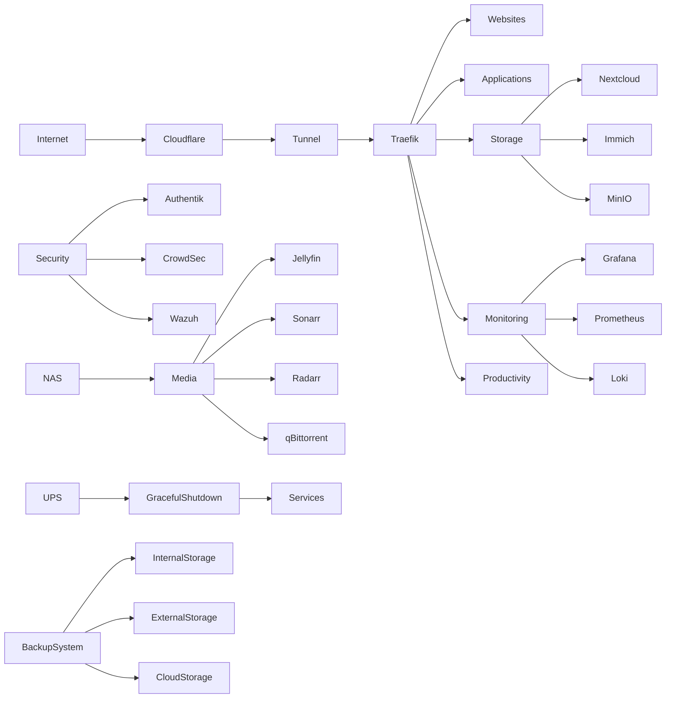

# Homelab Build Roadmap

## Overview

This homelab is a self-hosted infrastructure project designed to develop and demonstrate practical skills across systems administration, networking, DevOps, security, observability, automation, and operational resilience.

The environment is built using Docker Compose and organized into logical service stacks. Each phase introduces additional technologies and operational practices while building upon the foundation established in previous phases.

The project prioritizes:

* Documentation
* Security
* Recoverability
* Automation
* Operational maturity
* Continuous learning

The goal is to create an environment that reflects many of the practices used in modern production infrastructure while remaining maintainable, recoverable, and well documented.

---

# Objectives

The primary objectives of this project are to:

* Develop practical Linux administration skills
* Gain experience operating containerized infrastructure
* Learn networking, DNS, reverse proxying, and secure remote access
* Implement monitoring and observability platforms
* Develop security operations capabilities
* Practice backup and disaster recovery procedures
* Maintain production-style documentation
* Demonstrate infrastructure automation and operational maturity
* Create a public portfolio showcasing technical skills

---

# Build Phases

| Phase | Name                 | Focus                                                      |
| ----- | -------------------- | ---------------------------------------------------------- |
| 0     | Platform Preparation | Operating system, automation, backups and power protection |
| 1     | Foundation           | Core infrastructure and public services                    |
| 2     | Observability        | Monitoring, logging and alerting                           |
| 3     | Security             | Identity management and security monitoring                |
| 4     | Productivity         | Internal productivity applications                         |
| 5     | Expansion            | Additional storage, utilities and learning services        |
| 6     | NAS & Media          | Media services and NAS integration                         |

---

# Phase Documents

* PHASE_0_PLATFORM_PREPARATION.md
* PHASE_1_FOUNDATION.md
* PHASE_2_OBSERVABILITY.md
* PHASE_3_SECURITY.md
* PHASE_4_PRODUCTIVITY.md
* PHASE_5_EXPANSION.md
* PHASE_6_NAS_MEDIA.md

---

# Current Service Roadmap

## Phase 0 - Platform Preparation

### Core Platform

* Ubuntu Server
* OpenSSH

### Infrastructure

* Docker Engine
* Docker Compose
* Git
* VPN-based Remote Administration

### Operations

* Daily Backup Script
* Weekly Backup Script
* Monthly Backup Process
* Restore Script

### Power Protection

* UPS
* Automated Shutdown Script
* Automated Startup Script

### Documentation

* Git Repository
* Documentation Standards
* Troubleshooting Standards

---

## Phase 1 - Foundation

### Proxy

* Traefik
* Cloudflare Tunnel

### HTTP

* Public Website
* Project Website

### Management

* Dockhand

### Security

* Vaultwarden

### Storage

* Nextcloud

---

## Phase 2 - Observability

### Monitoring

* Prometheus
* Grafana
* Node Exporter
* cAdvisor
* Loki
* Alloy

### Management

* Dozzle
* Uptime Kuma

---

## Phase 3 - Security

### Security

* Authentik
* CrowdSec
* Wazuh

### Infrastructure

* Pi-hole

---

## Phase 4 - Productivity

### Management

* Homepage

### Productivity

* Paperless-NGX
* Vikunja
* BookStack

### Applications

* Mealie
* FreshRSS
* Wallos
* Linkding

### Utilities

* IT-Tools
* Stirling-PDF

### Infrastructure

* ntfy

---

## Phase 5 - Expansion

### Storage

* Immich
* MinIO

### Applications

* Actual Budget

### Utilities

* ChangeDetection.io
* PrivateBin

### Infrastructure

* Gluetun

---

## Phase 6 - NAS & Media

### Media

* Jellyfin
* qBittorrent
* Prowlarr
* Sonarr
* Radarr

---

# Operational Resilience

A major objective of this project is developing operational practices commonly used in enterprise environments.

The homelab is designed not only to host services but also to demonstrate backup management, disaster recovery, business continuity planning, automation, and infrastructure maintenance.

## Backup Strategy

The environment follows a multi-tier backup approach.

### Daily Backups

Purpose:

* Protect frequently changing application data
* Protect Docker volumes
* Protect configuration files
* Enable rapid recovery from accidental changes

Destination:

* Secondary internal storage

Retention:

* 7 days

### Weekly Backups

Purpose:

* Create complete recoverable snapshots of the environment

Destination:

* External storage

Retention:

* 4 weeks

### Monthly Backups

Purpose:

* Maintain an off-site recovery copy

Destination:

* Cloud storage

Retention:

* Long-term archival

---

## Disaster Recovery

The environment is designed so that services can be rebuilt using:

* Docker Compose files
* Environment configuration
* Documentation
* Backup archives
* Recovery procedures

This approach ensures container loss does not result in service loss.

---

## Power Protection

The environment includes a UPS (Uninterruptible Power Supply) to protect against:

* Power outages
* Brownouts
* Unexpected shutdowns
* Filesystem corruption
* Database corruption

### Low Battery Shutdown Procedure

When battery capacity reaches a defined threshold:

1. Stop media and non-critical services
2. Stop application services
3. Stop monitoring services
4. Stop storage services
5. Stop security services
6. Stop proxy services
7. Flush filesystem buffers
8. Gracefully shut down the operating system

### Power Restoration Procedure

When power returns:

1. Host system powers on automatically
2. Core networking services start
3. Proxy services start
4. Storage services start
5. Security services start
6. Monitoring services start
7. Application services start
8. Health validation checks execute

---

## Change Management

Major infrastructure changes are:

* Documented before deployment
* Tested after deployment
* Included in backup validation procedures
* Recorded in troubleshooting documentation

This approach helps ensure services remain recoverable, maintainable, and auditable over time.

---

## Documentation Standards

Every deployed service follows a documentation-first approach.

Each service includes:

* README.md
* README_INTERNAL.md
* TROUBLESHOOTING.md
* Docker Compose configuration
* Environment variable examples

Documentation covers:

* Deployment
* Configuration
* Validation
* Troubleshooting
* Backup procedures
* Recovery procedures

---

## Skills Demonstrated

### Systems Administration

* Linux Administration
* Service Management
* Filesystem Management
* System Hardening

### Networking

* DNS
* Reverse Proxying
* Cloudflare Integration
* Secure Remote Access
* VPN Technologies

### DevOps

* Docker
* Docker Compose
* Git
* Infrastructure Documentation
* Automation

### Monitoring

* Metrics Collection
* Logging
* Dashboard Development
* Availability Monitoring

### Security

* Identity Management
* Single Sign-On
* Threat Detection
* Security Monitoring
* Access Control

### Operations

* Backup Management
* Disaster Recovery
* Business Continuity Planning
* Change Management
* Incident Response

---

# Final Target Architecture

---

# Guiding Principles

* Documentation before expansion
* Backups before major changes
* Security by default
* Recoverability over complexity
* Automation where it improves reliability
* Continuous learning through implementation
* Operational maturity over feature count

The objective is to build a stable, secure, recoverable, and well-documented environment that demonstrates practical systems administration, networking, security, observability, and DevOps capabilities.
