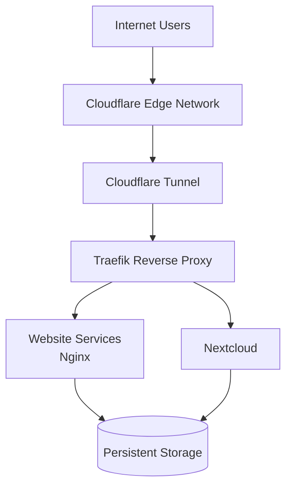
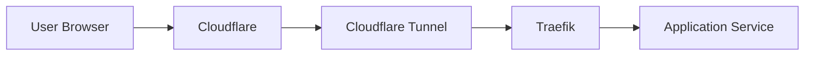
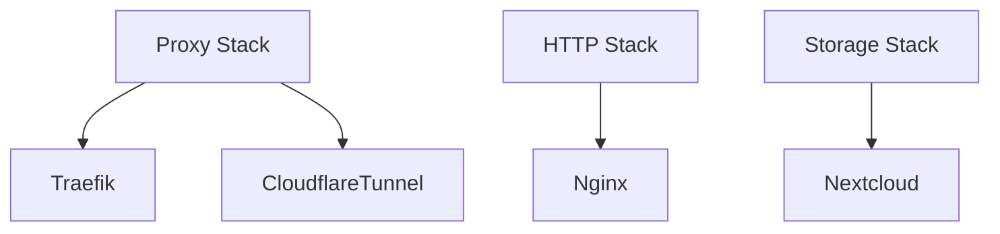
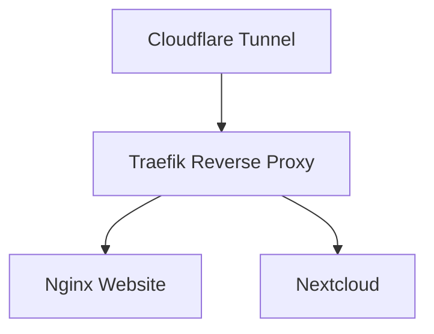
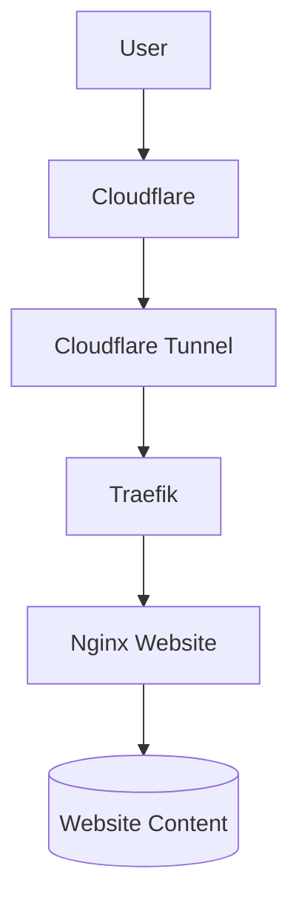
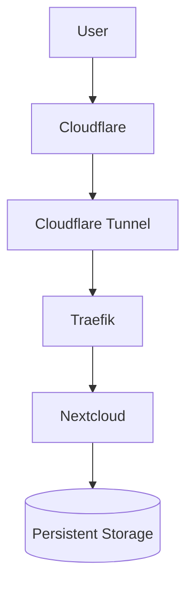
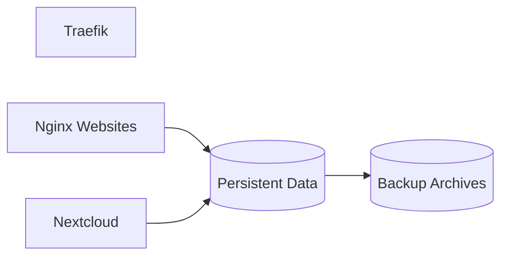
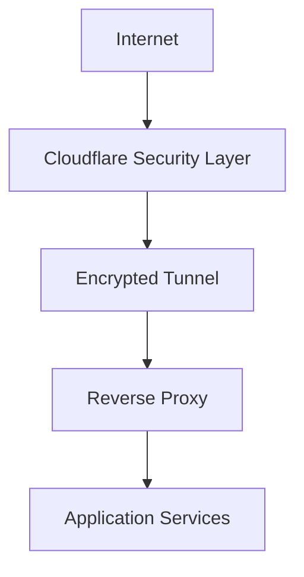
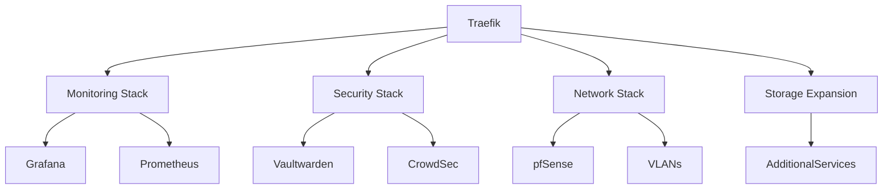

# Homelab Network Design

## Executive Summary

This document provides a high-level overview of the current homelab architecture.

The environment is designed around three core objectives:

* Secure service publishing
* Containerised application hosting
* Self-hosted storage and collaboration

Current deployed services include:

| Stack   | Services                   |
| ------- | -------------------------- |
| Proxy   | Traefik, Cloudflare Tunnel |
| HTTP    | Nginx Web Services         |
| Storage | Nextcloud                  |

The architecture follows a security-first approach by placing Cloudflare and Cloudflare Tunnel in front of all public-facing services, with Traefik providing centralised routing to backend applications.

---

# 1. Overall Architecture

### Diagram Explanation

This diagram shows the complete request flow through the environment.

All inbound traffic first reaches Cloudflare's global network before being securely transported through a Cloudflare Tunnel. Requests are then routed by Traefik to the appropriate backend service.

This design avoids exposing individual containers directly to the internet and centralises ingress management through a single reverse proxy.

---

# 2. Public Traffic Flow

### Diagram Explanation

This diagram focuses specifically on the external traffic path.

Rather than exposing applications directly, all traffic is inspected and processed by Cloudflare before being securely forwarded through a tunnel to the homelab environment.

Traefik then performs host-based routing and forwards requests to the appropriate application container.

---

# 3. Docker Stack Design

### Diagram Explanation

The homelab is organised into separate Docker Compose stacks.

This approach improves:

* Maintainability
* Troubleshooting
* Service isolation
* Documentation quality
* Future scalability

Each stack contains only closely related services and can be managed independently.

---

# 4. Reverse Proxy Architecture

### Diagram Explanation

Traefik acts as the central ingress controller for the environment.

Responsibilities include:

* Service discovery
* Host-based routing
* Reverse proxy functionality
* Middleware enforcement
* Future TLS management

By centralising routing through Traefik, backend services remain isolated and easier to manage.

---

# 5. HTTP Service Design

### Diagram Explanation

The HTTP stack hosts static web content using Nginx containers.

Traefik routes requests to the appropriate website container while website content is stored independently from the container lifecycle.

This allows containers to be recreated without impacting hosted content.

---

# 6. Nextcloud Service Design

### Diagram Explanation

Nextcloud provides self-hosted cloud storage and collaboration services.

Persistent storage is separated from the application container, ensuring user data survives upgrades, container recreation, and maintenance activities.

---

# 7. Data and Persistence Design

### Diagram Explanation

Containers are treated as disposable infrastructure components.

Persistent data is stored separately from application containers and is backed up independently.

This design simplifies:

* Disaster recovery
* Service migration
* Upgrades
* Container replacement

---

# 8. Current Security Model

### Diagram Explanation

Security is based on multiple layers.

Current protections include:

* Cloudflare edge protection
* Cloudflare Tunnel connectivity
* Centralised ingress through Traefik
* Isolated Docker services
* Separation of configuration and data

This layered approach reduces the attack surface and simplifies security management.

---

# 9. Future Architecture Roadmap

### Diagram Explanation

The environment has been designed for future expansion.

Planned additions include:

#### Monitoring

* Prometheus
* Grafana
* Node Exporter

#### Security

* Vaultwarden
* CrowdSec
* Fail2Ban

#### Networking

* pfSense
* VLAN segmentation
* Dedicated management network

#### Platform Improvements

* Centralised logging
* Infrastructure automation
* High availability evaluation
* Kubernetes evaluation

---

# Skills Demonstrated

This homelab demonstrates practical experience with:

* Linux Administration
* Docker
* Docker Compose
* Reverse Proxies
* Cloudflare Tunnels
* Network Architecture
* Infrastructure Documentation
* Service Isolation
* Data Persistence
* Backup Design
* Security Architecture
* Troubleshooting
* Infrastructure Planning

---

# Conclusion

This homelab provides a documented and repeatable infrastructure platform for learning and demonstrating modern systems administration, networking, containerisation, and security concepts.

The architecture prioritises simplicity, maintainability, and security while providing a foundation for future growth into monitoring, automation, advanced networking, and security tooling.
