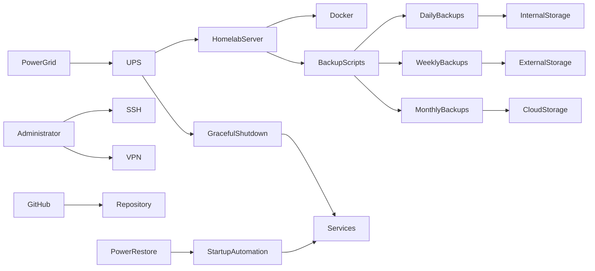

# Phase 0 - Platform Preparation

## Objective

Build a stable, recoverable, and maintainable platform before deploying any applications.

This phase establishes the operating system, remote administration, container platform, backup processes, documentation standards, and power protection mechanisms that will support all future services.

The goal is to ensure the environment can be rebuilt, recovered, monitored, and maintained before introducing application complexity.

---

# Services and Components

## Core Platform

* Ubuntu Server
* OpenSSH

## Infrastructure

* Docker Engine
* Docker Compose
* Git
* VPN-based Remote Administration

## Operations

* Daily Backup Script
* Weekly Backup Script
* Monthly Backup Process
* Restore Script

## Power Protection

* UPS
* Automated Shutdown Script
* Automated Startup Script

## Documentation

* GitHub Repository
* Documentation Standards
* Troubleshooting Standards
* Recovery Runbooks

---

# Skills Demonstrated

## Systems Administration

* Linux Administration
* User Management
* Filesystem Management
* Service Management
* System Hardening

## DevOps

* Git Version Control
* Infrastructure Documentation
* Configuration Management
* Automation

## Operations

* Backup Management
* Disaster Recovery
* Service Dependency Mapping
* Runbook Development

## Reliability Engineering

* Power Protection
* Graceful Shutdown Procedures
* Recovery Automation
* Business Continuity Planning

---

# Architecture

---

# Deliverables

## Operating System

* Ubuntu Server installed
* Static IP configured
* Timezone configured
* Automatic security updates configured

## Remote Administration

* SSH enabled
* SSH hardened
* VPN remote administration configured
* Remote access validated

## Container Platform

* Docker installed
* Docker Compose installed
* Container networking validated

## Source Control

* Git installed
* GitHub repository created
* Repository structure defined

## Documentation

* Public documentation standards defined
* Internal documentation standards defined
* Troubleshooting standards defined
* Recovery documentation established

## Backup Platform

* Daily backup automation implemented
* Weekly backup automation implemented
* Monthly backup process implemented
* Restore procedure validated

## Power Protection

* UPS installed
* UPS monitoring configured
* Graceful shutdown procedure tested
* Automatic recovery procedure tested

---

# Backup Strategy

The backup design follows a layered approach designed to balance recovery speed, storage efficiency, and resilience.

## Daily Backups

Purpose:

* Protect frequently changing application data
* Protect configuration files
* Allow rapid recovery from accidental changes

Destination:

* Secondary internal storage

Retention:

* 7 Days

Examples:

* Docker volumes
* Compose files
* Application data
* Databases
* Configuration files

---

## Weekly Backups

Purpose:

* Create complete recoverable snapshots of the environment

Destination:

* External storage

Retention:

* 4 Weeks

Examples:

* Application data
* Databases
* Documentation
* Infrastructure configuration
* Recovery scripts

---

## Monthly Backups

Purpose:

* Maintain an off-site recovery copy

Destination:

* Cloud storage

Retention:

* Long-term archival

Examples:

* Full backup archives
* Infrastructure documentation
* Disaster recovery resources

---

# Power Event Procedures

## Low Battery Shutdown Procedure

When the UPS reaches a defined low battery threshold:

1. Stop non-critical services
2. Stop application services
3. Stop monitoring services
4. Stop storage services
5. Stop security services
6. Stop proxy services
7. Flush filesystem buffers
8. Gracefully shut down the operating system

### Goals

* Prevent filesystem corruption
* Prevent database corruption
* Prevent incomplete writes
* Preserve service integrity

---

## Power Restoration Procedure

When utility power returns:

1. Host system powers on automatically
2. Core networking services start
3. Proxy services start
4. Storage services start
5. Security services start
6. Monitoring services start
7. Application services start
8. Validation checks execute

### Goals

* Ensure dependencies start in the correct order
* Minimize manual intervention
* Reduce recovery time

---

# Change Management

Major infrastructure changes follow a documented process.

Changes are:

* Documented before deployment
* Tested after deployment
* Included in backup validation procedures
* Recorded in troubleshooting documentation
* Reviewed during future maintenance activities

This approach helps maintain a stable and recoverable environment as complexity increases.

---

# Success Criteria

* Remote administration operational
* Docker platform operational
* Git repository operational
* Backup automation operational
* Restore procedures validated
* UPS monitoring operational
* Graceful shutdown tested
* Automated startup tested
* Documentation standards established

---

# Why This Phase Exists

Many homelab projects begin by deploying applications immediately.

This project intentionally establishes operational maturity before deploying services.

By implementing backups, disaster recovery procedures, documentation standards, automation, and power protection first, the environment more closely reflects real-world infrastructure and operational practices.

This phase provides the foundation upon which all future services depend.
