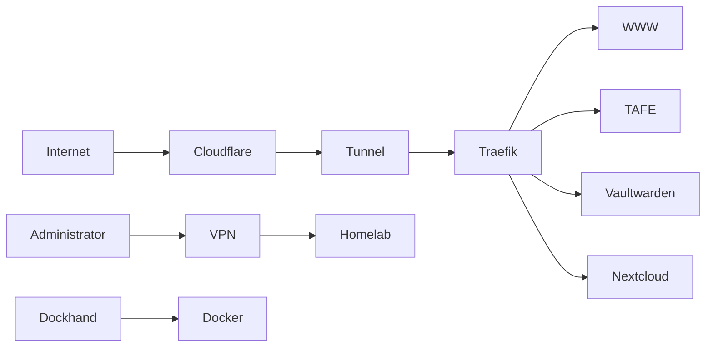

# Phase 1 - Foundation

## Objective

Establish the core infrastructure services required to host applications, provide secure external access, and deliver foundational self-hosted services.

This phase introduces reverse proxying, secure ingress, password management, file storage, and remote administration.

All future phases depend on the services deployed during this stage.

---

# Services

## Proxy

### Traefik

Purpose:

* Reverse proxy
* Service routing
* SSL termination
* Centralized ingress management

### Cloudflare Tunnel

Purpose:

* Secure inbound connectivity
* Reduce public attack surface
* Eliminate direct port exposure

---

## HTTP

### www

Purpose:

* Primary public website
* Static content hosting
* Portfolio and project presentation

### tafe

Purpose:

* Training and education projects
* Development and testing environment

---

## Management

### Dockhand

Purpose:

* Docker management
* Container visibility
* Administrative convenience

---

## Security

### Vaultwarden

Purpose:

* Password management
* Credential storage
* Secure secrets handling

---

## Storage

### Nextcloud

Purpose:

* File synchronization
* Document storage
* Self-hosted cloud services

---

## Infrastructure

### VPN-Based Remote Administration

Purpose:

* Secure remote administration
* Remote troubleshooting
* Infrastructure management

---

# Skills Demonstrated

## Linux Administration

* Service Management
* Process Management
* Filesystem Management

## Docker

* Docker Compose
* Container Networking
* Persistent Storage
* Service Dependencies

## Networking

* Reverse Proxying
* DNS Concepts
* HTTPS
* Traffic Routing

## Security

* Password Management
* Secure Remote Access
* Service Segmentation

## Documentation

* Service Documentation
* Troubleshooting Documentation
* Recovery Procedures

---

# Architecture

---

# Security Notice

This documentation intentionally omits:

* Internal IP addresses
* Hostnames
* Domain names
* VPN configuration
* Authentication secrets
* API keys
* Access tokens
* Encryption material
* Internal network architecture details

All examples are provided for documentation purposes only.

---

# Operational Considerations

Prior to deployment:

* Documentation updated
* Backup procedures reviewed
* Recovery procedures validated
* Service dependencies documented

Following deployment:

* Health checks validated
* Monitoring updated
* Documentation revised
* Backups verified

---

# Success Criteria

* Reverse proxy operational
* External routing operational
* Public websites accessible
* Vaultwarden operational
* Nextcloud operational
* Remote administration operational
* Container management operational

---

# Why This Phase Exists

This phase establishes the core platform required for all future services.

Without centralized routing, storage, authentication, and administration capabilities, later monitoring, security, and productivity services would become significantly more difficult to manage.

Completing this phase provides a stable, documented, and recoverable foundation for future expansion.
