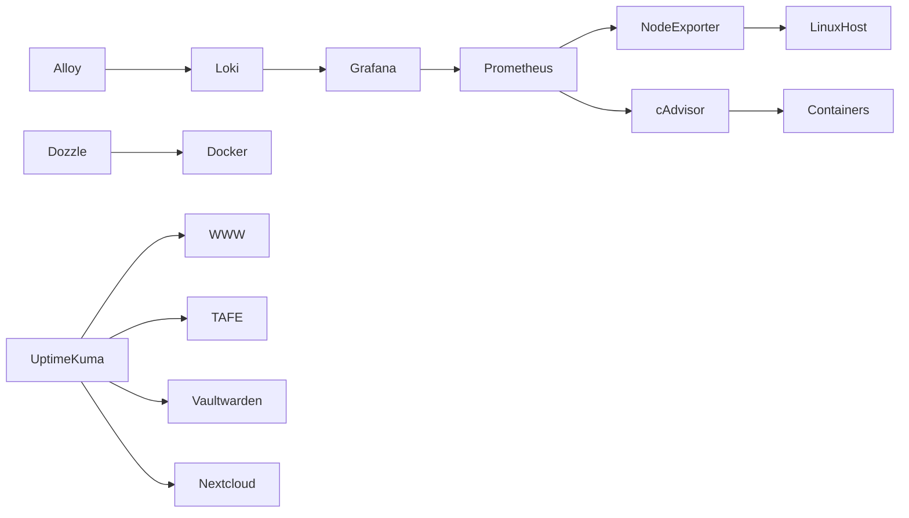

# Phase 2 - Observability

## Objective

Introduce monitoring, logging, alerting, and service visibility across the environment.

This phase establishes the observability platform required to proactively monitor infrastructure health, resource utilization, service availability, and application performance.

The goal is to identify issues before they become outages and provide operational insight into the environment.

---

# Services

## Monitoring

### Prometheus

Purpose:

* Metrics collection
* Time-series data storage
* Infrastructure monitoring

### Grafana

Purpose:

* Dashboard creation
* Visualization of metrics
* Operational reporting

### Node Exporter

Purpose:

* Linux host monitoring
* CPU metrics
* Memory metrics
* Filesystem metrics
* Network metrics

### cAdvisor

Purpose:

* Container monitoring
* Resource utilization visibility
* Docker performance metrics

### Loki

Purpose:

* Centralized log storage
* Log aggregation
* Log analysis

### Alloy

Purpose:

* Metrics collection
* Log collection
* Telemetry forwarding

---

## Management

### Dozzle

Purpose:

* Container log visibility
* Simplified troubleshooting
* Real-time container monitoring

### Uptime Kuma

Purpose:

* Service availability monitoring
* Endpoint monitoring
* Notification integration

---

# Skills Demonstrated

## Monitoring

* Infrastructure Monitoring
* Service Monitoring
* Availability Monitoring
* Resource Monitoring

## Observability

* Metrics Collection
* Log Aggregation
* Dashboard Development
* Performance Analysis

## Docker

* Container Telemetry
* Resource Analysis
* Service Health Monitoring

## Operations

* Incident Detection
* Troubleshooting
* Capacity Planning
* Performance Tuning

## Reliability Engineering

* Proactive Monitoring
* Alerting Strategy
* Operational Visibility
* Service Validation

---

# Architecture

---

# Monitoring Scope

## Infrastructure

Monitored Components:

* CPU Utilization
* Memory Utilization
* Filesystem Usage
* Network Utilization
* System Load
* Uptime

---

## Containers

Monitored Components:

* Container Status
* Container Restarts
* Resource Consumption
* Network Activity
* Storage Utilization

---

## Services

Monitored Components:

* Service Availability
* Response Times
* Endpoint Health
* Service Dependencies

---

## Logging

Collected Logs:

* Container Logs
* Application Logs
* Reverse Proxy Logs
* Infrastructure Logs

---

# Security Notice

This documentation intentionally omits:

* Internal IP addresses
* Hostnames
* Domain names
* Authentication secrets
* API keys
* Access tokens
* Internal network architecture details

All examples are provided for documentation purposes only.

---

# Operational Considerations

Prior to deployment:

* Monitoring requirements documented
* Service dependencies reviewed
* Backup procedures validated
* Recovery procedures reviewed

Following deployment:

* Dashboards validated
* Health checks confirmed
* Alerting tested
* Documentation updated

---

# Alerting Philosophy

The monitoring platform is designed to provide actionable information rather than excessive notifications.

Alerting should focus on:

* Service outages
* Resource exhaustion
* Critical failures
* Backup failures
* Infrastructure instability

Monitoring should support operational decision making rather than generate unnecessary noise.

---

# Success Criteria

* Host metrics visible
* Container metrics visible
* Service availability monitored
* Centralized logging operational
* Dashboards operational
* Alerting operational
* Historical metrics retained
* Health checks validated

---

# Why This Phase Exists

As environments grow, troubleshooting becomes increasingly difficult without visibility into infrastructure health and service performance.

This phase introduces the tooling required to understand how the environment behaves under normal and abnormal conditions.

By implementing observability before expanding the platform further, future services can be monitored, validated, and supported using a consistent operational framework.

This phase provides the visibility layer upon which security, productivity, and future services will depend.
