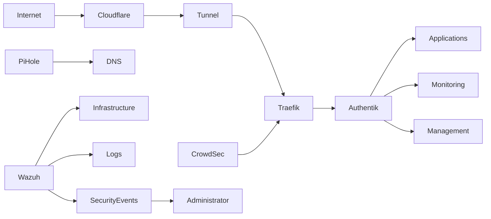

# Phase 3 - Security

## Objective

Implement identity management, DNS filtering, threat detection, and security monitoring across the environment.

This phase introduces centralized authentication, security event visibility, access control, and proactive threat detection capabilities commonly found in enterprise environments.

The goal is to improve security posture while developing practical cybersecurity, identity management, and security operations experience.

---

# Services

## Identity & Access Management

### Authentik

Purpose:

* Single Sign-On (SSO)
* Identity Provider (IdP)
* Multi-factor Authentication (MFA)
* Access Management

Benefits:

* Centralized authentication
* Reduced credential sprawl
* Consistent access control
* Improved user experience

---

## Threat Protection

### CrowdSec

Purpose:

* Threat detection
* Reputation-based blocking
* Automated response
* Attack prevention

Benefits:

* Protection against common attacks
* Community-driven threat intelligence
* Automated mitigation
* Reduced attack surface

---

## Security Monitoring

### Wazuh

Purpose:

* Security Information and Event Management (SIEM)
* Host monitoring
* Log analysis
* Security event detection

Benefits:

* Centralized security visibility
* Compliance-oriented monitoring
* Security auditing
* Incident investigation support

---

## Infrastructure Security

### Pi-hole

Purpose:

* DNS filtering
* Advertisement blocking
* Domain-based threat reduction
* DNS visibility

Benefits:

* Reduced malicious domain exposure
* Improved privacy
* Reduced unnecessary traffic
* DNS-level control

---

# Skills Demonstrated

## Cybersecurity

* Threat Detection
* Security Monitoring
* Attack Surface Reduction
* Incident Investigation
* Security Operations

## Identity Management

* Single Sign-On
* Authentication Management
* Access Control
* Multi-factor Authentication

## Infrastructure Security

* DNS Security
* Network Filtering
* Security Hardening
* Logging and Auditing

## Operations

* Security Event Monitoring
* Threat Intelligence
* Incident Response
* Security Documentation

---

# Architecture

---

# Security Strategy

## Authentication

Authentication is centralized through a single identity provider.

Protected services may include:

* Administrative interfaces
* Monitoring platforms
* Internal applications
* Documentation platforms

Benefits:

* Consistent access policies
* Reduced password reuse
* Simplified account management

---

## DNS Protection

DNS filtering provides:

* Malicious domain blocking
* Advertisement blocking
* Tracking reduction
* Improved visibility into DNS activity

DNS is often one of the easiest control points to improve security across an environment.

---

## Threat Detection

CrowdSec provides:

* Detection of malicious activity
* Reputation-based blocking
* Automated response capabilities
* Community-driven threat intelligence

The objective is to reduce manual intervention while improving protection.

---

## Security Monitoring

Wazuh provides visibility into:

* Authentication events
* Configuration changes
* Service status
* System activity
* Security-related events

This supports both troubleshooting and incident response activities.

---

# Security Notice

This documentation intentionally omits:

* Internal IP addresses
* Hostnames
* Domain names
* VPN configuration
* Firewall rules
* Authentication secrets
* API keys
* Access tokens
* Encryption materials
* Internal network architecture details

All examples are provided for documentation purposes only.

---

# Operational Considerations

Prior to deployment:

* Access requirements documented
* Authentication strategy reviewed
* Monitoring requirements defined
* Backup procedures validated

Following deployment:

* Authentication tested
* MFA validated
* Monitoring verified
* Security events reviewed
* Documentation updated

---

# Incident Response Goals

Security tooling should support:

* Detection
* Investigation
* Containment
* Recovery
* Documentation

The environment is designed to improve understanding of security operations processes rather than simply deploy security products.

---

# Success Criteria

* Single Sign-On operational
* Multi-factor Authentication operational
* DNS filtering operational
* Threat detection operational
* Security monitoring operational
* Security events visible
* Protected services integrated
* Documentation updated

---

# Why This Phase Exists

As infrastructure grows, visibility and access control become increasingly important.

This phase introduces security controls that improve both protection and operational maturity.

By implementing authentication, monitoring, DNS filtering, and threat detection before deploying additional applications, future services inherit a stronger security foundation.

This phase provides the security layer upon which future productivity, storage, and media services will depend.
