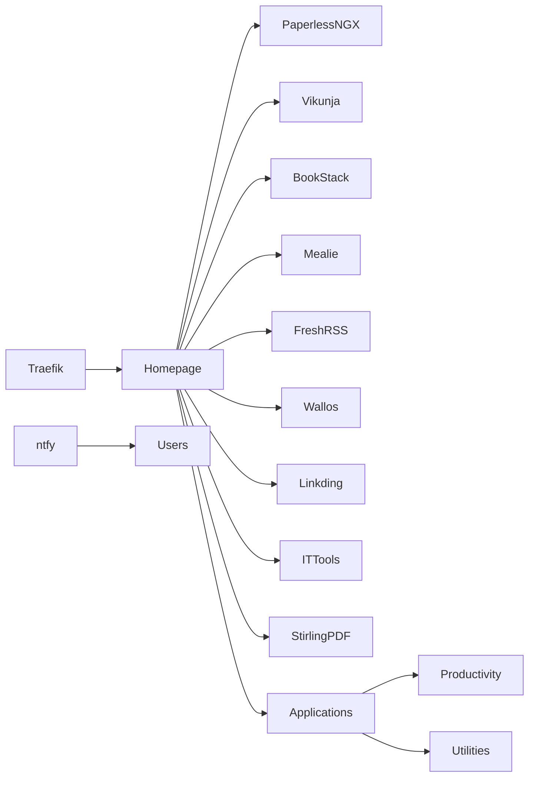

# Phase 4 - Productivity

## Objective

Deploy self-hosted productivity, collaboration, knowledge management, and utility applications that support day-to-day workflows while providing experience operating business-focused services.

This phase introduces platforms commonly used for document management, task tracking, knowledge sharing, content aggregation, notifications, and productivity enhancement.

The goal is to develop experience managing multiple application stacks while maintaining operational standards established in previous phases.

---

# Services

## Management

### Homepage

Purpose:

* Central service dashboard
* Service discovery
* Operational visibility
* Single entry point for applications

Benefits:

* Simplified navigation
* Improved service accessibility
* Centralized platform management

---

## Productivity

### Paperless-ngx

Purpose:

* Document management
* OCR processing
* Digital archiving
* Searchable document storage

Benefits:

* Reduced paper dependency
* Centralized document repository
* Improved document retrieval

---

### Vikunja

Purpose:

* Task management
* Project planning
* Workflow tracking
* Personal productivity

Benefits:

* Structured task organization
* Project visibility
* Workflow management

---

### BookStack

Purpose:

* Documentation platform
* Knowledge management
* Runbook storage
* Technical documentation

Benefits:

* Centralized knowledge base
* Standardized documentation
* Improved information sharing

---

## Applications

### Mealie

Purpose:

* Recipe management
* Meal planning
* Shopping list generation

---

### FreshRSS

Purpose:

* RSS aggregation
* Content monitoring
* Information management

---

### Wallos

Purpose:

* Subscription tracking
* Cost visibility
* Budget awareness

---

### Linkding

Purpose:

* Bookmark management
* Knowledge capture
* Research organization

---

## Utilities

### IT-Tools

Purpose:

* Technical utilities
* Network tools
* Development tools
* Administrative helpers

---

### Stirling-PDF

Purpose:

* PDF management
* Document conversion
* Document manipulation

---

## Infrastructure

### ntfy

Purpose:

* Notification platform
* Service alerts
* Infrastructure notifications
* Automation integration

---

# Skills Demonstrated

## Application Administration

* Application Deployment
* Service Configuration
* User Management
* Application Maintenance

## Documentation

* Knowledge Management
* Documentation Standards
* Information Organization
* Technical Writing

## Operations

* Service Lifecycle Management
* Backup Integration
* Monitoring Integration
* Change Management

## Productivity Platforms

* Document Management
* Workflow Management
* Information Management
* Notification Systems

---

# Architecture

---

# Service Categories

## Knowledge Management

Services:

* BookStack
* Linkding

Purpose:

* Preserve operational knowledge
* Store documentation
* Organize reference material
* Support troubleshooting

---

## Document Management

Services:

* Paperless-ngx
* Stirling-PDF

Purpose:

* Manage digital documents
* Automate document processing
* Improve information retrieval

---

## Task & Workflow Management

Services:

* Vikunja

Purpose:

* Organize projects
* Track progress
* Manage workloads

---

## Information Aggregation

Services:

* FreshRSS

Purpose:

* Centralize information sources
* Monitor industry developments
* Improve situational awareness

---

## Notifications

Services:

* ntfy

Purpose:

* Infrastructure notifications
* Monitoring alerts
* Service status updates
* Automation workflows

---

# Security Notice

This documentation intentionally omits:

* Internal IP addresses
* Hostnames
* Domain names
* Authentication secrets
* API keys
* Access tokens
* Internal network architecture details

All examples are provided for documentation purposes only.

---

# Operational Considerations

Prior to deployment:

* Documentation updated
* Backup procedures reviewed
* Authentication requirements defined
* Monitoring integration planned

Following deployment:

* Backups validated
* Monitoring integrated
* Authentication tested
* Notifications verified
* Documentation updated

---

# Operational Standards

All services introduced during this phase should:

* Integrate with centralized authentication where appropriate
* Participate in backup procedures
* Participate in monitoring procedures
* Be documented before production use
* Have defined recovery procedures

These standards help maintain consistency as the environment grows.

---

# Success Criteria

* Homepage operational
* Knowledge base operational
* Document management operational
* Task management operational
* Notification platform operational
* Monitoring integrated
* Backup coverage validated
* Documentation completed

---

# Why This Phase Exists

Once infrastructure, observability, and security foundations are established, the environment can begin delivering practical day-to-day value.

This phase focuses on business-oriented and productivity-focused services that improve organization, knowledge management, workflow tracking, and operational efficiency.

By introducing these applications after monitoring and security are established, services can be deployed within a mature operational framework rather than as standalone applications.

This phase provides the productivity layer that supports ongoing administration, learning, and personal workflows throughout the remainder of the homelab journey.
