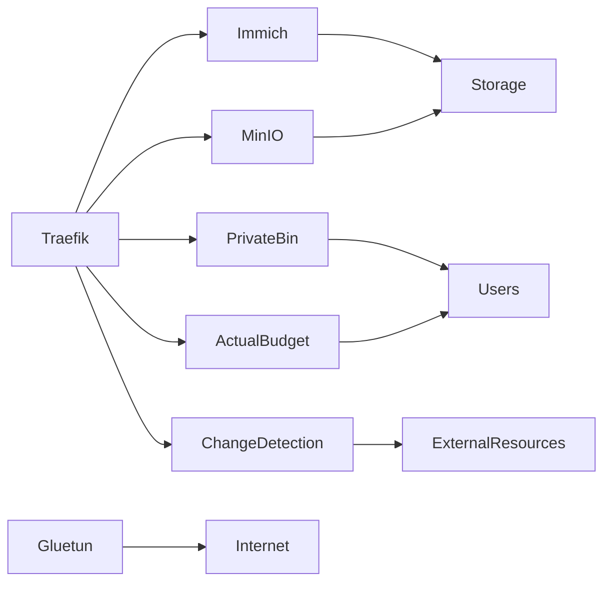

# Phase 5 - Expansion

## Objective

Expand the platform with advanced storage, privacy-focused services, utility applications, and additional infrastructure components that provide learning opportunities beyond core business services.

This phase introduces technologies commonly found in modern cloud environments, including object storage, photo management, secure content sharing, change monitoring, and VPN-based traffic routing.

The goal is to broaden technical experience across storage architecture, networking, privacy, and service isolation while maintaining the operational maturity established in previous phases.

---

# Services

## Storage

### Immich

Purpose:

* Photo management
* Video management
* Media organization
* Mobile synchronization

Benefits:

* Self-hosted photo platform
* Reduced dependency on third-party cloud providers
* Centralized media management

---

### MinIO

Purpose:

* Object storage
* S3-compatible storage
* Application storage backend
* Storage architecture learning

Benefits:

* Exposure to object storage concepts
* API-driven storage management
* Cloud-native storage experience

---

## Applications

### Actual Budget

Purpose:

* Personal budgeting
* Financial tracking
* Expense visibility
* Financial planning

Benefits:

* Self-hosted financial management
* Data ownership
* Personal workflow enhancement

---

## Utilities

### ChangeDetection.io

Purpose:

* Website monitoring
* Content change detection
* Automation triggers
* Information tracking

Benefits:

* Automated monitoring of external resources
* Notification-driven workflows
* Situational awareness

---

### PrivateBin

Purpose:

* Secure note sharing
* Temporary information exchange
* Encrypted content sharing

Benefits:

* Privacy-focused sharing
* Reduced reliance on third-party services
* Controlled information distribution

---

## Infrastructure

### Gluetun

Purpose:

* VPN client container
* Traffic isolation
* Secure outbound routing
* Network segmentation

Benefits:

* Enhanced privacy
* Controlled network paths
* Improved service isolation

---

# Skills Demonstrated

## Storage

* Object Storage Concepts
* Storage Architecture
* Data Management
* Media Management

## Networking

* VPN Integration
* Network Isolation
* Traffic Routing
* Secure Connectivity

## Privacy & Security

* Secure Data Sharing
* Encrypted Communications
* Privacy-Focused Services
* Service Segmentation

## Operations

* Service Expansion
* Platform Growth
* Dependency Management
* Operational Planning

## Cloud Concepts

* Object Storage
* API-Based Services
* Modern Storage Platforms
* Cloud-Native Architectures

---

# Architecture

---

# Service Categories

## Media & Storage

Services:

* Immich
* MinIO

Purpose:

* Store and organize media
* Explore cloud-native storage concepts
* Develop storage architecture experience

---

## Personal Applications

Services:

* Actual Budget

Purpose:

* Personal finance management
* Data ownership
* Self-hosted alternatives

---

## Privacy Services

Services:

* PrivateBin
* Gluetun

Purpose:

* Secure information sharing
* Network privacy
* Traffic isolation

---

## Monitoring & Automation

Services:

* ChangeDetection.io

Purpose:

* Monitor external resources
* Detect content changes
* Trigger notifications and workflows

---

# Security Notice

This documentation intentionally omits:

* Internal IP addresses
* Hostnames
* Domain names
* Authentication secrets
* API keys
* Access tokens
* VPN configurations
* Internal network architecture details

All examples are provided for documentation purposes only.

---

# Operational Considerations

Prior to deployment:

* Storage requirements documented
* Backup impact assessed
* Authentication requirements reviewed
* Monitoring requirements defined

Following deployment:

* Backup coverage validated
* Monitoring integrated
* Authentication tested
* Storage utilization monitored
* Documentation updated

---

# Storage Considerations

As storage-focused services are introduced, additional attention should be given to:

* Backup capacity
* Retention policies
* Storage growth
* Recovery testing
* Data lifecycle management

Storage services typically become some of the largest consumers of infrastructure resources and should be managed accordingly.

---

# Operational Standards

All services introduced during this phase should:

* Integrate with centralized authentication where appropriate
* Participate in backup procedures
* Participate in monitoring procedures
* Be documented before production use
* Have validated recovery procedures

This ensures consistency across the expanding environment.

---

# Success Criteria

* Immich operational
* MinIO operational
* VPN routing operational
* Secure sharing operational
* Change monitoring operational
* Monitoring integrated
* Backup coverage validated
* Documentation completed

---

# Why This Phase Exists

After establishing infrastructure, monitoring, security, and productivity capabilities, the platform can begin expanding into more specialized technologies.

This phase introduces services that provide practical experience with storage architecture, privacy-focused tooling, object storage, and advanced networking concepts.

The services deployed during this phase are intended to broaden technical exposure and create opportunities to learn technologies commonly encountered in cloud, DevOps, infrastructure, and systems administration environments.

This phase provides the expansion layer that prepares the platform for large-scale storage and media services introduced in the final phase.
