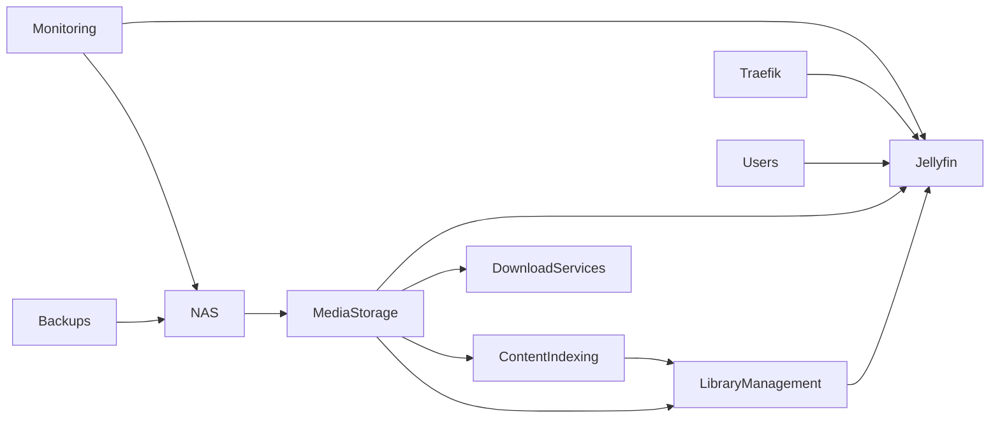

# Phase 6 - NAS & Media

## Objective

Integrate dedicated network-attached storage (NAS) and deploy media-focused services that leverage centralized storage, automated content management, and scalable data architecture.

This phase introduces storage-heavy workloads and demonstrates concepts commonly found in enterprise storage environments, including centralized storage management, media delivery, automation workflows, data retention planning, and infrastructure scalability.

The goal is to gain practical experience operating applications that rely on shared storage, large datasets, and service orchestration while maintaining the operational standards established throughout previous phases.

---

# Prerequisites

Before beginning this phase, the following should already be operational:

* Platform Preparation completed
* Foundation services operational
* Monitoring platform operational
* Security platform operational
* Productivity platform operational
* Expansion services operational
* Backup procedures validated
* Recovery procedures tested

Additionally:

* NAS deployed
* Shared storage configured
* Capacity planning completed
* Backup strategy updated to include NAS data

---

# Services

## Media Server

### Jellyfin

Purpose:

* Media streaming
* Content organization
* Multi-device access
* Personal media library management

Benefits:

* Self-hosted media platform
* Complete data ownership
* Centralized content delivery

---

## Download Management Services

Purpose:

* Download workflow management
* Content acquisition automation
* Queue management

Benefits:

* Reduced manual administration
* Workflow automation
* Service orchestration experience

---

## Content Indexing Services

Purpose:

* Metadata management
* Content discovery
* Search integration

Benefits:

* Automated content organization
* Improved user experience
* Enhanced media management

---

## Media Library Management Services

Purpose:

* Automated library maintenance
* Content lifecycle management
* Media categorization

Benefits:

* Reduced administrative overhead
* Consistent content organization
* Automated workflows

---

# Skills Demonstrated

## Storage Administration

* NAS Management
* Shared Storage
* Capacity Planning
* Data Lifecycle Management

## Systems Administration

* Large Dataset Management
* Service Scaling
* Resource Planning
* Infrastructure Expansion

## Networking

* Network Storage
* Shared Services
* Service Integration
* Storage Architecture

## Operations

* Workflow Automation
* Service Orchestration
* Backup Planning
* Disaster Recovery

## Platform Engineering

* Multi-Service Integration
* Dependency Management
* Infrastructure Design
* Scalability Planning

---

# Architecture

---

# Storage Architecture

## Centralized Storage

The NAS serves as the primary storage platform for:

* Media libraries
* Application data
* Long-term archives
* Shared resources

Benefits:

* Centralized data management
* Simplified backup procedures
* Improved storage utilization
* Easier scalability

---

## Backup Strategy

The backup strategy established in Phase 0 is extended to include NAS workloads.

### Daily

Purpose:

* Protect frequently changing data

Destination:

* Secondary storage

---

### Weekly

Purpose:

* Full storage snapshots

Destination:

* External storage

---

### Monthly

Purpose:

* Off-site recovery copy

Destination:

* Cloud storage

---

## Recovery Objectives

Recovery procedures should be documented for:

* NAS failure
* Storage corruption
* Service restoration
* Data recovery
* Hardware replacement

---

# Monitoring Requirements

Storage-intensive workloads require additional monitoring.

Key metrics include:

* Storage utilization
* Filesystem health
* Network throughput
* Service availability
* Resource consumption
* Backup success rates

Monitoring should integrate with the observability platform established in Phase 2.

---

# Security Considerations

The security controls introduced in Phase 3 should extend to media services where appropriate.

Examples include:

* Authentication controls
* Access restrictions
* Logging
* Monitoring
* Backup validation

The objective is to maintain consistency across the entire environment.

---

# Security Notice

This documentation intentionally omits:

* Internal IP addresses
* Hostnames
* Domain names
* Authentication secrets
* API keys
* Access tokens
* Storage paths
* Internal network architecture details

All examples are provided for documentation purposes only.

---

# Operational Considerations

Prior to deployment:

* Storage capacity reviewed
* Backup impact assessed
* Recovery procedures documented
* Monitoring requirements defined

Following deployment:

* Storage utilization validated
* Backup coverage verified
* Monitoring integrated
* Documentation updated
* Recovery procedures tested

---

# Operational Standards

All services introduced during this phase should:

* Participate in backup procedures
* Participate in monitoring procedures
* Be documented before production use
* Have validated recovery procedures
* Have defined maintenance procedures

These standards ensure the platform remains recoverable, maintainable, and scalable.

---

# Success Criteria

* NAS operational
* Shared storage operational
* Media platform operational
* Automated workflows operational
* Monitoring integrated
* Backup coverage validated
* Recovery procedures documented
* Documentation completed

---

# Why This Phase Exists

This phase represents the culmination of the homelab roadmap.

By this stage, the platform has established:

* Operational maturity
* Monitoring capabilities
* Security controls
* Backup procedures
* Documentation standards
* Automation workflows

The introduction of NAS-backed services provides experience operating larger-scale storage workloads while demonstrating practical knowledge of storage architecture, scalability planning, and service orchestration.

This phase showcases the ability to build, secure, monitor, document, and maintain a complete self-hosted infrastructure environment using practices aligned with modern systems administration, infrastructure engineering, DevOps, and cybersecurity disciplines.
